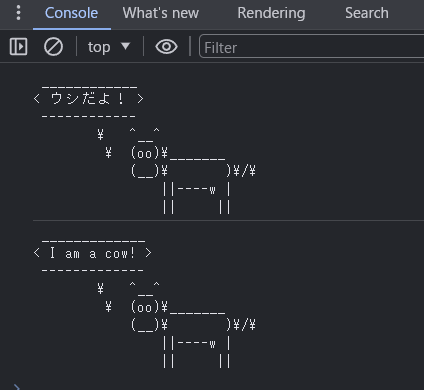

# 勉強会：npmライブラリをWebアプリから使う方法

## はじめに

JavaScriptは歴史的な経緯で複数のモジュール形式を持っています
* IIFE(Immediately-invoked function expression)
* CommonJS
* AMD(Asynchronous Module Definition)
* UMD(Universal Module Definition)
* ES Modules

現在はCommonJSからESModuleへの過渡期です

npmでライブラリをインストールすると、どちらか一方だったり、両方含まれていたりいろいろな状況ですが
基本的にはバンドラーがうまいことやってくれるので、気にしなくても大丈夫(なことが多いです)

もう少し詳しく知りたいとか歴史が好きな人は、下記の参考リンクをご確認ください
* [Node.jsとはなにか？なぜみんな使っているのか？](https://qiita.com/non_cal/items/a8fee0b7ad96e67713eb)
* [JavaScriptの歴史をまとめてみる](https://frog-song.hatenablog.com/entry/2020/12/04/005522)
* [JavaScriptのモジュールについてまとめてく: 歴史編](https://zenn.dev/ebi_yu/scraps/db4c7d1f3e883a)
* [JavaScriptモジュールシステムのこれまでとこれから](https://qiita.com/riku_takeuchi/items/4fd0bca8a99ac14aed45)
* [Node.js + TypeScriptのモジュールを整理してみる](https://blog.koh.dev/2024-04-23-nodejs-typescript-module/)


## npm (Node Package Manager)とは

* JavaScriptのライブラリ(パッケージ)をインストールするソフトだと思えば大丈夫
* [node.js](https://nodejs.org/)付属のツールです
* 依存関係を解決してくれるので、AがBを利用している場合、両方インストールしてくれます
  (最初にjQueryを読み込んで次にプラグインを・・・・みたいなことは考えなくてよくなった）

## 最低限の使い方(node環境)
```
$ mkdir cowsay; cd cowsay;
$ npm init -y
$ npm install cowsay
$ cat <<EOF > cowsay.js
> const cowsay = require("cowsay");
> console.log(cowsay.say({text : "ウシだよ！"}));
> EOF
$ node cowsay.js
 ____________
< ウシだよ！ >
 ------------
        \   ^__^
         \  (oo)\_______
            (__)\       )\/\
                ||----w |
                ||     ||
```


## cowsay.jsをhtmlファイルで読み込んでみる

node環境で動作した`cowsay.js`をブラウザ環境で実行すると？

```html
<!doctype html>
<html lang="en">
<head>
  <meta charset="utf-8">
  <title>cowsay</title>
</head>
<body>
  <script src="cowsay.js"></script>
</body>
</html>
```

* (Webブラウザには)require()がないので、実行エラーになる

* そもそもあったとしても`node_module`の中にあるので読み込めない(パスが違う)


## nodeライブラリを利用するため、バンドルを行う

ビルド対象に指定したファイルから、芋づる式に依存ファイルを見つけて1つにまとめる処理を`バンドル`といいます

### 1. バンドラー(rollup.js)をインストールする

rollup本体＋node用のプラグイン をインストールする

バンドラーは[webpack](https://webpack.js.org/)が有名ですが、設定ファイルが非常に複雑なため書きやすい[rollup.js](https://rollupjs.org/)を利用します

* nodeモジュールの依存解決と、commonjsを読み込み可能にするプラグインが必要

```
$ npm i -D rollup @rollup/plugin-commonjs @rollup/plugin-node-resolve
```

### 2. バンドル用の設定ファイルを作成する

* コメントを参照のこと

rollup.config.mjs
```js
import commonjs from '@rollup/plugin-commonjs';
import resolve from '@rollup/plugin-node-resolve';

export default {
  input: './cowsay.js', // バンドル対象のファイル名。このファイルを元に読み込まれているjsを探してまとめる
  output: {
    file: './dist/bundle.js', // 出力ファイル名
    format: 'esm', // ESモジュール形式で出力する
  },
  plugins: [
    resolve(), // importしたライブラリの依存関係を解決して、node_moduleから見つける
    commonjs(), // commonjs形式のライブラリを読み込み可能にする
  ],
};
```

### 3. バンドル処理を実行する

`cowsay.js` を元に、必要なjsを1つにまとめて`bundle.js`を出力する

```
$ npx rollup -c

./cowsay.js → ./dist/bundle.js...
created ./dist/bundle.js in 134ms
```

### 4. htmlを修正して再度jsを実行してみる

```html
<!doctype html>
<html lang="en">
<head>
  <meta charset="utf-8">
  <title>cowsay</title>
</head>
<body>
  <script type="module" src="./dist/bundle.js"></script>
</body>
</html>
```

ブラウザで表示すると、npmのライブラリ(を呼びだすjs)が実行できたことを確認できます


### バンドル後のファイルを見てみる

ライブラリのjsとcowsay.jsがマージされています

./dist/bundle.js

```js
function getAugmentedNamespace(n) {
  if (n.__esModule) return n;
  var f = n.default;
	if (typeof f == "function") {
		var a = function a () {
			if (this instanceof a) {
        return Reflect.construct(f, arguments, this.constructor);
			}
			return f.apply(this, arguments);
		};
		a.prototype = f.prototype;
  } else a = {};

// ～～1000行ほど省略して最後の部分～～

var require$$0 = /*@__PURE__*/getAugmentedNamespace(cowsay_es);

const cowsay = require$$0;
console.log(cowsay.say({text : "ウシだよ！"}));

export { cowsay$1 as default };
```


## おまけ：htmlの&lt;script&gt;タグ内で`cowsay`を呼び出してみる

(バンドル関係ではなくモジュール間の呼び出し方法の話です)

commonJSの流儀に従い`module.exports`で外部に公開します

```js
const cowsay = require('cowsay');
console.log(cowsay.say({ text: 'ウシだよ！' }));

module.exports = cowsay; // 外部に公開する
```


cowsayを`import`して呼び出します(バンドル後はESModuleになるため、JavaScriptの流儀に従って`import`する)

(余談ですが、importは&lt;script&gt;タグと同様に、外部サイトから読み込むこともできます)

```html
<!doctype html>
<html lang="en">
<head>
  <meta charset="utf-8">
  <title>cowsay</title>
</head>
<body>
  <script type="module">
    import cowsay from './dist/bundle.js';
    console.log(cowsay.say({ text: 'I am a cow!' }));
  </script>
</body>
</html>
```

呼び出しできました

