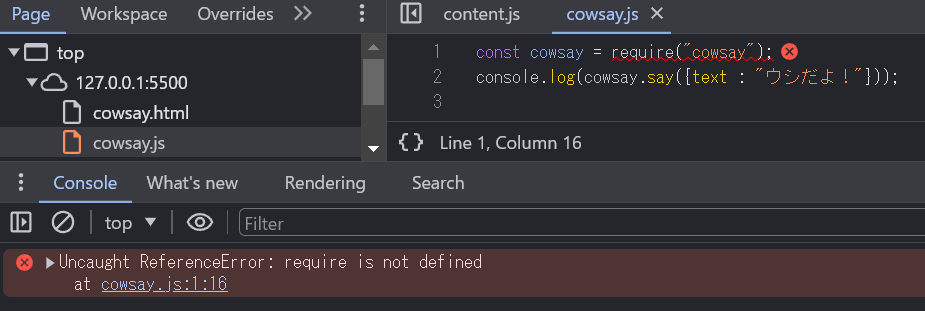
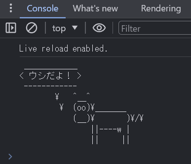

# 勉強会：npmライブラリをWebアプリから使う方法

## npm (Node Package Manager)とは

この辺参照
[そもそもnpmからわからない](https://zenn.dev/antez/articles/a9d9d12178b7b2)

・JavaScriptのライブラリ(パッケージ)をインストールするソフトだと思えば大丈夫
・依存関係を解決してくれるので、AがBを利用している場合、両方インストールしてくれます
  (最初にjQueryを読み込んで次にプラグインを・・・・みたいなことは考えなくてよくなった）

## 最低限の使い方(node環境)
```
$ mkdir cowsay; cd cowsay;
$ npm init -y
$ npm install cowsay
$ cat <<EOF > cowsay.js
> const cowsay = require("cowsay");
> console.log(cowsay.say({text : "ウシだよ！"}));
> EOF
$ node cowsay.js
 ____________
< ウシだよ！ >
 ------------
        \   ^__^
         \  (oo)\_______
            (__)\       )\/\
                ||----w |
                ||     ||
```


## cowsay.jsをhtmlファイルで読み込んでみる

```html
<!doctype html>
<html lang="en">
<head>
  <meta charset="utf-8">
  <title>cowsay</title>
</head>
<body>
  <script src="cowsay.js"></script>
</body>
</html>
```

(Webブラウザには)require()がないので、実行エラーになる



## nodeライブラリを利用するためバンドルを行う
### バンドラー(rollup.js)をインストール
```
$ npm i -D rollup @rollup/plugin-commonjs @rollup/plugin-node-resolve
```

### バンドル用の設定ファイルを作成する

* nodeモジュールの依存解決と、commonjsを読み込み可能にするプラグインが必要

rollup.config.mjs
```js
import commonjs from '@rollup/plugin-commonjs';
import resolve from '@rollup/plugin-node-resolve';

export default {
  input: './cowsay.js', // バンドル対象のファイル名。このファイルを元に読み込まれているjsを探してまとめる
  output: {
    file: './dist/bundle.js', // 出力ファイル名
    format: 'esm', // ESモジュール形式で出力する
  },
  plugins: [
    resolve(), // importしたライブラリの依存関係を解決して、node_moduleから見つける
    commonjs(), // commonjs形式のライブラリを読み込み可能にする
  ],
};
```

### jsファイルをバンドル

cowsay.js を元に、必要なjsを1つにまとめてbundle.jsを出力する

```
$ npx rollup -c

./cowsay.js → ./dist/bundle.js...
created ./dist/bundle.js in 134ms
```

### htmlを修正して再度jsを実行してみる

```
<!doctype html>
<html lang="en">
<head>
  <meta charset="utf-8">
  <title>cowsay</title>
</head>
<body>
  <script type="module" src="./dist/bundle.js"></script>
</body>
</html>
```

ブラウザで表示すると、npmのライブラリが実行できたことを確認できます




### バンドル後のファイル
./dist/bundle.js

```js
function getAugmentedNamespace(n) {
  if (n.__esModule) return n;
  var f = n.default;
	if (typeof f == "function") {
		var a = function a () {
			if (this instanceof a) {
        return Reflect.construct(f, arguments, this.constructor);
			}
			return f.apply(this, arguments);
		};
		a.prototype = f.prototype;
  } else a = {};

// ～～1000行ほど省略～～

var require$$0 = /*@__PURE__*/getAugmentedNamespace(cowsay_es);

const cowsay = require$$0;
console.log(cowsay.say({text : "ウシだよ！"}));

export { cowsay$1 as default };
```